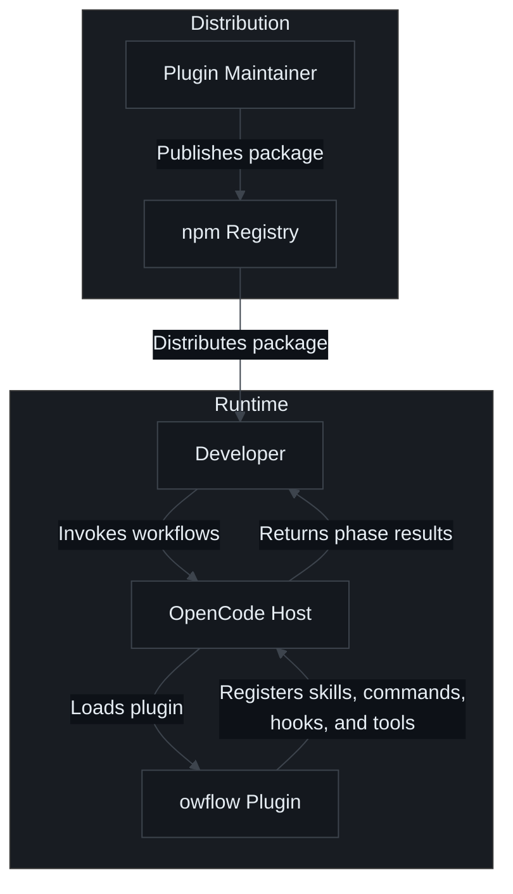
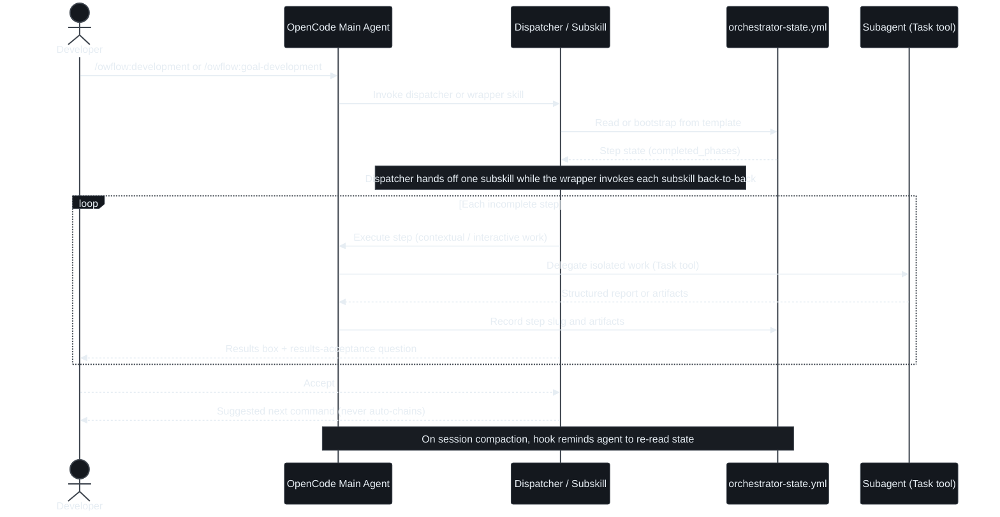

# System Architecture

## Overview
owflow is an OpenCode plugin that registers an agentic SDLC system at runtime: it contributes skills, commands, and subagents to the host, plus hooks and tools that enforce workflow safety and state consistency. The "product" is a markdown-defined workflow engine — dispatcher skills route to standalone subskills that drive step-by-step task execution, delegate heavy work to isolated subagents, and persist progress in per-task YAML state files. As of 0.6.0, all four workflows (development, research, performance, migration) follow this decomposed shape.

## Architecture Pattern
**Pattern**: OpenCode plugin with runtime registration + markdown-defined workflow engine (state-machine orchestration).

The plugin entry point (`src/index.ts`, default-exported `OwflowPlugin`) never runs workflows itself. It performs three registration duties — config mutation (skills path, command palette, subagent definitions), lifecycle hooks (compaction reminder, destructive-command guard, session attribution), and custom tools (`verify_template`, `fork_task`). Workflow logic lives entirely in `src/skills/**` markdown, interpreted by the host agent at invocation time, with `.owflow/tasks/**/orchestrator-state.yml` as the durable state.

Two modes share one state file per split workflow: an assisted dispatcher (`/owflow:development`, `/owflow:research`, `/owflow:performance`, `/owflow:migration`) hands off one subskill per invocation, and an autonomous wrapper (`/owflow:goal-development`, `/owflow:goal-research`, `/owflow:goal-performance`, `/owflow:goal-migration`) runs every step in one session; either can be mixed on the same task.

## System Structure

### Plugin Entry & Lifecycle
- **Location**: `src/index.ts`, `src/hooks/`
- **Purpose**: Wire all capabilities into the OpenCode config/hooks lifecycle
- **Key Files**: `src/index.ts` (`OwflowPlugin`), `src/hooks/before-tool.ts` (blocks destructive bash commands for non-whitelisted agents), `src/hooks/session-compaction.ts` (post-compaction state re-read reminder)

### Configuration Layer
- **Location**: `src/configuration/`
- **Purpose**: Register agents, commands, and skills into the host config; synthesize command wrappers from skill frontmatter
- **Key Files**: `agents-config.ts` (23 subagents, model aliasing), `commands-config.ts` (6 maintained + 46 synthesized, fail-fast frontmatter contract), `skills-config.ts` (adds plugin skills path)

### Workflow Engine (Skills)
- **Location**: `src/skills/` (51 skills: 46 user-invocable, 5 internal)
- **Purpose**: Markdown-defined dispatchers, standalone subskills, and wrappers implementing the four workflows; shared contracts in `orchestrator-framework/references/` (gate contract, delegation rules, dispatcher handoff, state schema)
- **Key Files**: `development/SKILL.md`, `research/SKILL.md`, `migration/SKILL.md`, `performance/SKILL.md`, `goal-*/SKILL.md`, `dev-*/SKILL.md`, `research-*/SKILL.md`, `migration-*/SKILL.md`, `performance-*/SKILL.md`

### Subagents
- **Location**: `src/agents/` (23 definitions, all `mode: subagent`, `hidden: true`)
- **Purpose**: Isolated execution roles for analysis, planning, implementation, verification, and docs (e.g., `implementation-planner`, `task-group-implementer`, `code-reviewer`, `spec-auditor`, `docs-operator`)
- **Key Files**: one markdown file per agent with frontmatter `name`, `description`, `model`, `mode`

### Commands
- **Location**: `src/commands/` (6 maintained), generated at runtime (46 wrappers)
- **Purpose**: Slash-command surface; the 46 wrappers are synthesized from `SKILL.md` frontmatter via `renderCommandTemplate`, removing duplication
- **Key Files**: `src/commands/*.md` (`work`, `reviews-*`), `src/configuration/commands-config.ts`

### Tools
- **Location**: `src/tools/`
- **Purpose**: `verify_template` validates `orchestrator-state.yml` against a template's key structure; `fork_task` deep-copies a research task and trims state at a fork point
- **Key Files**: `src/tools/verify_template.ts`, `src/tools/fork_task.ts`, `src/utils/yaml-structure.ts`, `src/utils/fork-task.ts`

### State & Templates
- **Location**: `src/templates/` (5 YAML templates: base + 4 workflows), `.owflow/tasks/` (runtime)
- **Purpose**: Versioned task-state shape; descriptive step slugs tracked in `orchestrator.completed_phases` with resume semantics — development 13 slugs (`codebase-analysed`, `tdd-red-proven`, `spec-written`, `implementation-done`, `e2e-run`, `task-completed`, …), migration 10, performance 9 (`codebase-analysed`, `bottlenecks-identified`, `options-chosen`, `verification-done`, …), research 8 (`brief-written`, …)
- **Key Files**: `src/templates/orchestrator-state-*.yml`

### Build & Distribution
- **Location**: `src/` → `dist/` via `bun tsc` + `scripts/copy-markdowns.js`
- **Purpose**: Publish `dist/` (compiled JS + copied markdown assets) + README + LICENSE to npm
- **Key Files**: `package.json`, `tsconfig.json`, `bunfig.toml`, `scripts/copy-markdowns.js`

## Visual Architecture Context
**Type**: `flowchart` — system-level view: who uses owflow, what it registers into, and how it is distributed. Flowchart rather than `C4Context` so each relationship has its own edge and the label stays readable. Component internals stay in "System Structure" above.

## Data Flow
1. OpenCode loads `dist/index.js` and calls the plugin factory.
2. The config hook registers the skills path, command palette, and 23 subagents; lifecycle hooks and tools are registered.
3. A user invokes a command (e.g., `/owflow:development "task"`); the synthesized wrapper instructs the agent to invoke the skill first.
4. The orchestrator skill creates or resumes a task under `.owflow/tasks/<type>/<date-name>/`, bootstrapping `orchestrator-state.yml` from a template.
5. Phases execute: the main agent performs interactive/contextual work and delegates isolated work to subagents via the Task tool; skills are invoked via the Skill tool.
6. Each phase gate records completion slugs in state and presents a results box with a results-acceptance question; subskills never auto-chain.
7. Artifacts (analysis, spec, plan, work log, verification reports) accumulate in the task directory; `verify_template` can validate the state shape.
8. At session compaction, the hook injects a reminder to re-read state so the workflow resumes correctly.

## Component Communication Flow
**Type**: `sequenceDiagram` — time-ordered view of one workflow invocation, showing dispatcher-to-subskill routing, skill vs. subagent delegation, and the step-gate loop. Complements the narrative "Data Flow" above.

## External Integrations
- **OpenCode host runtime** — plugin config, hooks, tools, skill/agent/command registration
- **npm registry** — distribution of the `owflow` package
- **GitHub / Codeberg remotes** — source hosting (GitHub Actions CI added 2026-10-08; Codeberg runner pending)
- No databases, third-party APIs, or network services at runtime

## Database Schema
Not applicable. Structured persistence is YAML state files validated structurally against `src/templates/*.yml` by the `verify_template` tool.

## Configuration
- **Build/tooling**: `package.json`, `tsconfig.json`, `bunfig.toml`
- **Host registration**: runtime mutation of the OpenCode config object (never overwrites user-configured agents/commands)
- **Workflow runtime**: `.owflow/tasks/**/orchestrator-state.yml`; docs and standards in `.owflow/docs/`
- **Project instructions**: `AGENTS.md` (AI contributor guide)

## Deployment Architecture
No containers or cloud infrastructure. Deployment is `npm publish` guarded by `prepack` → `bun run build` (rm dist → type-check → tests → copy markdowns). Local development installs via `bun run local-install` (`opencode plugin "$(pwd)" --global --force`).

---
*Based on codebase analysis performed 2026-10-05*
