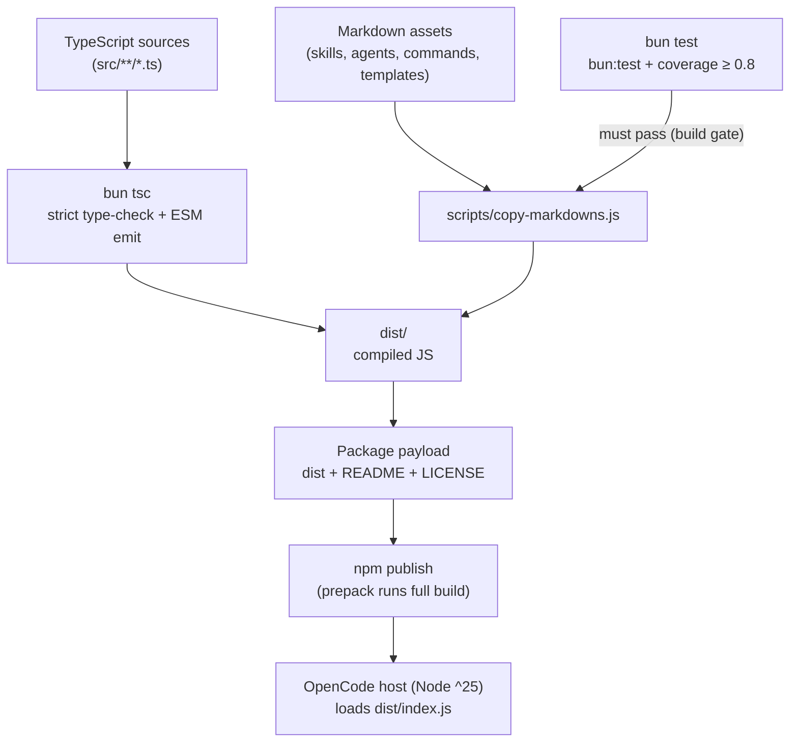

# Technology Stack

## Overview
This document describes the technology choices and rationale for owflow, an OpenCode plugin distributed via npm.

## Languages

### TypeScript 5 (peer `^5`)
- **Usage**: ~100% of source code (`src/`, 13 modules, ~679 lines of TS plus tests)
- **Rationale**: The OpenCode plugin API is typed; strict typing protects a logic-heavy registration and state-machine layer; declarations are the intended public interface
- **Key Features Used**: ESM (`"type": "module"`, NodeNext resolution, explicit `.js` import extensions), `strict`, `noUncheckedIndexedAccess`, `noImplicitOverride`, `verbatimModuleSyntax`, `import type`

### Markdown + YAML frontmatter
- **Usage**: The majority of the product surface — 51 skills (`SKILL.md`), 23 agent definitions, 6 maintained commands, templates
- **Rationale**: Skills/agents/commands are declarative content consumed by OpenCode; frontmatter is the single source of truth from which commands are synthesized at runtime

## Frameworks

### Frontend
None. No UI framework, no web assets — this is a plugin library.

### Backend
None. No server framework, HTTP API, or long-running service. The only runtime framework is the OpenCode plugin API:

- **`@opencode-ai/plugin` `^1.18.4`** — plugin entry contract (`Plugin` type), custom tool factory (`tool()`), config mutation and lifecycle hook types

### Testing
- **`bun:test`** — `describe`/`test`/`expect`, `spyOn` module mocking, `beforeEach`/`afterEach`; 151 tests across 10 suites with YAML fixtures
- **Bun coverage** — enabled in `bunfig.toml` (text + lcov reporters, threshold 0.8, `dist` and tests ignored)

## Database
None. Persistence is file-based: orchestrator state lives in `orchestrator-state.yml` files under `.owflow/tasks/`, parsed/stringified with the `yaml` package. Task artifacts are markdown. OpenCode configuration is mutated in-memory through the plugin API.

## Build Tools & Package Management
- **Bun** (`bunfig.toml`, `bun.lock`) — dev, build, and test runtime
- **`bun tsc`** — type-check and emit ESM JavaScript to `dist/`
- **`scripts/copy-markdowns.js`** — copies skills, agents, commands, and templates into `dist/` (128 markdown assets; the published `dist/` also contains the compiled JS — 141 files total in the payload)
- **npm** — publish path only (`package-lock.json` also committed; `prepack` runs the build as a publish guard)
- **Node ^25** — host engine requirement (`engines` field)

## Build & Runtime Flow
**Type**: `flowchart` — lightweight view of how sources become the published package and reach the host runtime. All facts are from `package.json` scripts and `tsconfig.json`; no runtime services exist.

## Infrastructure

### Containerization
None detected.

### CI/CD
None. Build/test gates run only via local `prepack` or the `local-install` script (`bun run build && opencode plugin "$(pwd)" --global --force`). Adding CI is a roadmap technical-debt item.

### Hosting
npm registry (distribution). No hosted service, database, or cloud infrastructure.

## Development Tools

### Linting & Formatting
None enforced (no ESLint/Prettier/EditorConfig). Style is manual and consistent: 2-space indent, double quotes, semicolons, trailing commas.

### Type Checking
`bun tsc` with strict settings; tests are excluded from emit via tsconfig and have a nested `tsconfig.json` (`noEmit`) for editor support.

## Key Dependencies
| Dependency | Version | Role |
|---|---|---|
| `@opencode-ai/plugin` | `^1.18.4` | Plugin API, tool factory, lifecycle types |
| `gray-matter` | `^4.0.3` | YAML frontmatter parsing for skills/agents/commands |
| `yaml` | `^2.4.1` | Parse/stringify orchestrator state and templates |
| `@types/bun` | `^1.3.13` (dev) | Bun API types for tests and tooling |

Minimal dependency surface is a deliberate design principle — 3 runtime dependencies.

## Version Management
Semver in `package.json` (currently `0.4.3`, pre-1.0). No CHANGELOG; no git tags observed. Version is exposed to the plugin at runtime via `src/utils/plugin-info.ts` (read from `package.json` with an `unknown` fallback).

## Migration Path (for legacy projects)
Not applicable — modern stack throughout (Bun, TypeScript 5, Node ^25). Known gap: `types: dist/index.d.ts` is declared but declarations are never emitted (no `declaration: true` in tsconfig); fix or remove is a roadmap item.

---
*Last Updated*: 2026-10-01
*Auto-detected*: languages, versions, dependencies, build/test tooling, absence of CI/linting/containers, distribution model — all from repository inspection
