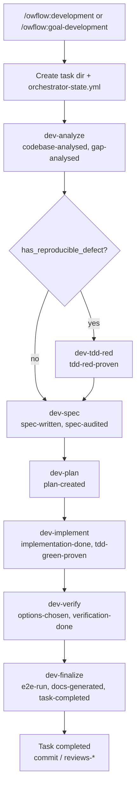
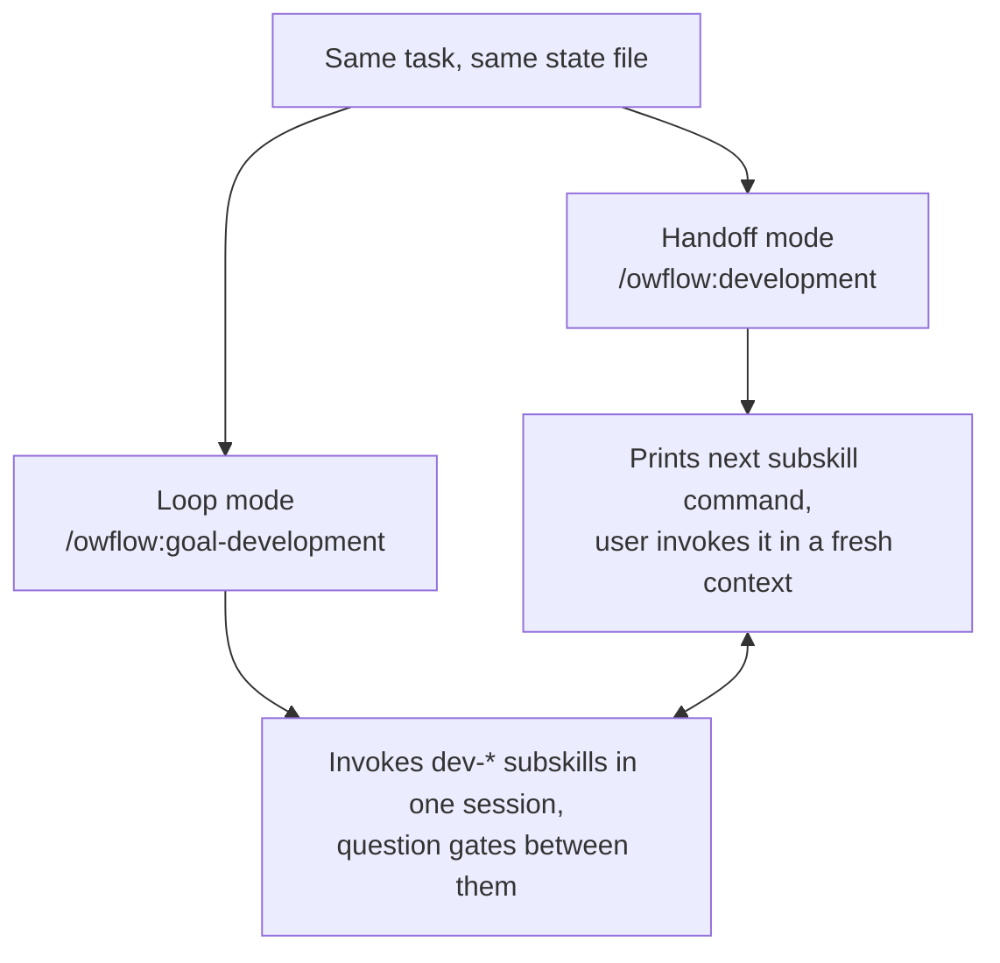
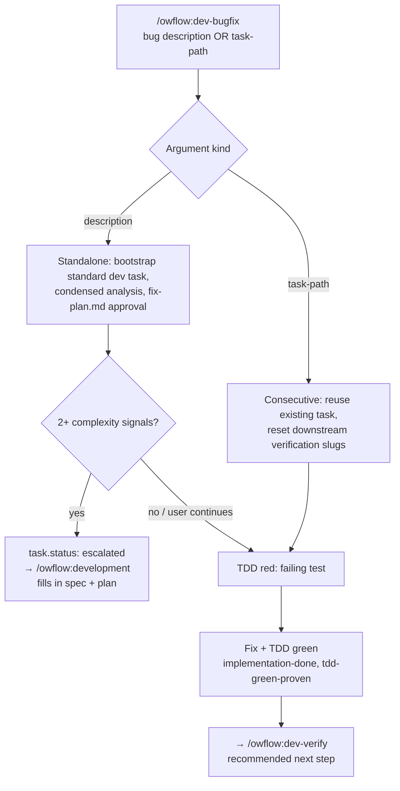
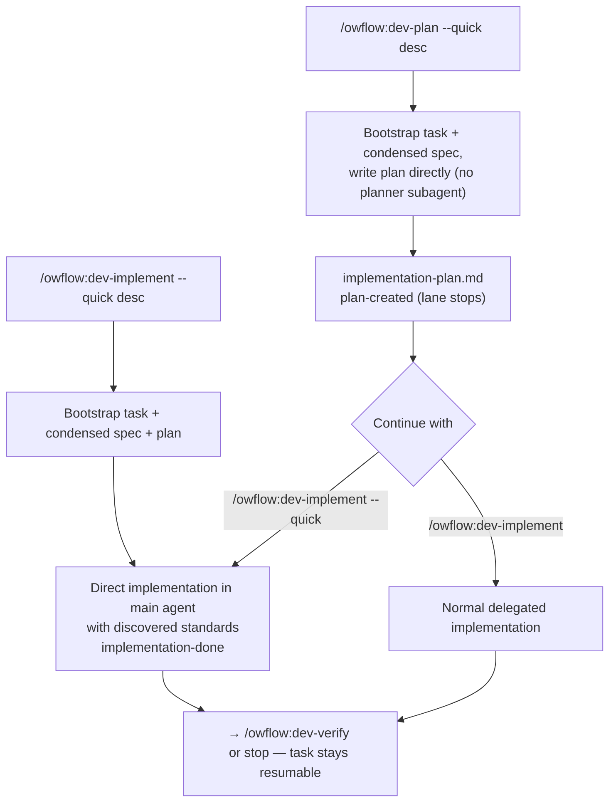
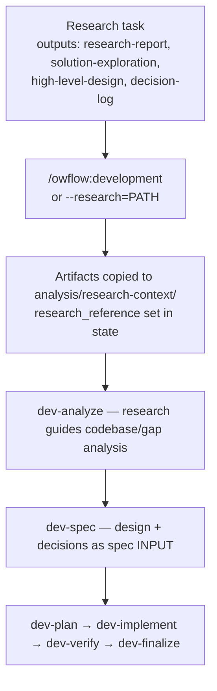

# Workflow Details

Owflow provides four workflow types, each with phases tailored to its needs. All workflows pause between phases for your review and input.

## Development Workflow

Development work runs through a pipeline of standalone **dev-\* subskills**, coordinated by a shared task state file (`orchestrator-state.yml`). Two top-level orchestrators start and route the pipeline:

- **Handoff mode** — `/owflow:development` initializes/resumes the task, derives the next step from state, prints the matching subskill command, and stops. Each subskill runs in a fresh context.
- **Loop mode** — `/owflow:goal-development` runs the same subskills back-to-back in one session, pausing at gates between them. Tasks can mix both modes freely.

Both modes share one state format. Progress is tracked as descriptive step slugs in `completed_phases`: `codebase-analysed`, `gap-analysed`, `tdd-red-proven`, `spec-written`, `spec-audited`, `plan-created`, `implementation-done`, `tdd-green-proven`, `options-chosen`, `verification-done`, `e2e-run`, `docs-generated`, `task-completed`.

### Pipeline Steps

| Step (slug)                           | Subskill                | Produces                                              |
| ------------------------------------- | ----------------------- | ----------------------------------------------------- |
| Codebase + gap analysis               | `/owflow:dev-analyze`   | `analysis/codebase-analysis.md`, `gap-analysis.md`    |
| TDD red gate (conditional — bugs)     | `/owflow:dev-tdd-red`   | `implementation/tdd-red-gate.md` (failing test)       |
| Requirements + specification + audit  | `/owflow:dev-spec`      | `implementation/spec.md`, `verification/spec-audit.md`|
| Implementation planning               | `/owflow:dev-plan`      | `implementation/implementation-plan.md`               |
| Implementation + TDD green gate       | `/owflow:dev-implement` | implemented code, `work-log.md`, `tdd-green-gate.md`  |
|                                       |                         | (full pipeline: delegated to implementation-plan-executor) |
| Verification + issue resolution       | `/owflow:dev-verify`    | `verification/implementation-verification.md`         |
| E2E + user docs + finalization        | `/owflow:dev-finalize`  | `documentation/`, completed task                      |

The TDD red gate is skipped unless gap analysis detects a reproducible defect (`has_reproducible_defect: true`). The TDD green gate runs inside dev-implement only when a red gate was executed. Conditional options (`--e2e`, `--user-docs`, `--audit`) are stored in state and honored by the subskills.

### Entry Points

Every entry level below ends in the same pipeline and the same state file — you can enter fast and escalate to the full pipeline at any time.

#### 1. Full pipeline (features, enhancements, bugs)

```bash
/owflow:development "Add two-factor authentication"
/owflow:goal-development "Add two-factor authentication"     # loop mode
```

Auto-detects the task type. The dispatcher initializes the task, then hands off step-by-step.



#### 2. Handoff vs loop mode



#### 3. Quick bug lane (`/owflow:dev-bugfix`)

Lightweight TDD-driven bug fix: condensed analysis → approved fix plan → TDD red → fix → TDD green. Creates a **standard** development task (`entry_point: dev-bugfix`), so it is continuable by any dev-\* subskill afterwards. Also used as a consecutive run to fix a newly emerging problem on an existing task (resets downstream verification slugs).



The dispatcher routes bugfix tasks straight to `/owflow:dev-verify` when `implementation-done` is complete (spec/plan are not required for verification). Escalated tasks route through the full pipeline from the first missing slug.

#### 4. Quick dev lanes (`--quick`)

Condensed entries that bootstrap a standard task inline, then continue with the lane's condensed work. Use when analysis/spec phases can be done in one pass.



The `dev-implement --quick` lane implements **directly in the main agent** (applying the standards read during the condensed prelude, with continuous discovery for newly-surfaced areas) — it never routes through the implementation-plan-executor or its subagents. The same applies when `--quick` is passed to `/owflow:dev-implement` on an existing task (e.g., a quick plan). Full-pipeline runs are unaffected: without `--quick`, implementation always delegates.

#### 5. Research-based development

Start development informed by a completed research workflow. Research context flows through all phases (it never skips any):

```bash
/owflow:development .owflow/tasks/research/2026-01-12-oauth-research
/owflow:development "Implement OAuth" --research=.owflow/tasks/research/2026-01-12-oauth-research
```



#### 6. Standalone subskills

Each dev-\* subskill is standalone and can be invoked directly with a task path or identifier; it validates prerequisites from state and prints the ordered prerequisite steps with exact commands if something is missing. Never auto-picks a task. The usual reason to enter mid-pipeline is resuming: `/owflow:dev-verify`, `/owflow:dev-finalize`, or continuing an escalated/bugfix task with `/owflow:dev-spec`.

### Flags

`--from=<step-slug>`, `--research=PATH`, `--audit`/`--no-audit`, `--e2e`/`--no-e2e`, `--user-docs`/`--no-user-docs`

### Resume

```bash
/owflow:development [task-path] [--from=<step-slug>] [--reset-attempts]
```

Resume derives from state: the first step slug not in `completed_phases` determines the next subskill; `--from` overrides (prerequisites are validated). Works across handoff and loop modes, including tasks started by `/owflow:dev-bugfix` or a `--quick` lane.

### Auto-Recovery

Retries are owned by each subskill (max attempts per phase):

| Subskill       | Max Attempts | Strategy                            |
| -------------- | ------------ | ----------------------------------- |
| dev-analyze    | 2            | Expand search, re-analyze, ask user |
| dev-tdd-red    | 2            | Rewrite test, skip TDD with doc     |
| dev-spec       | 2            | Regenerate spec                     |
| dev-plan       | 2            | Regenerate plan                     |
| dev-implement  | 5 (green)    | Fix syntax, imports, tests          |
| dev-verify     | 3 (loop)     | Fix issues, re-run verification     |
| dev-finalize   | 3            | Fix tests, re-run                   |

---

## Performance Optimization

Static code analysis to detect bottlenecks, followed by standard spec/plan/implement/verify pipeline.

```
/owflow:performance
/owflow:performance "Optimize dashboard loading time"
```

### Phases

| #   | Phase                                                                                                     |
| --- | --------------------------------------------------------------------------------------------------------- |
| 1   | Codebase analysis + clarifications                                                                        |
| 2   | Static performance analysis (N+1 queries, missing indexes, O(n^2) algorithms, blocking I/O, memory leaks) |
| 3   | Requirements + specification                                                                              |
| 4   | Specification audit (conditional)                                                                         |
| 5   | Implementation planning                                                                                   |
| 6   | Implementation execution                                                                                  |
| 7   | Verification options                                                                                      |
| 8   | Verification + issue resolution                                                                           |
| 9   | Finalization                                                                                              |

**Optional profiling data**: You can provide runtime profiling data, flame graphs, or APM screenshots. The workflow creates `analysis/user-profiling-data/` for these files.

### Resume

```
/owflow:performance [task-path] [--from=PHASE] [--reset-attempts]
```

Resume phases: `analysis`, `specification`, `planning`, `implementation`, `verification`

---

## Migration

Technology, data, and architecture migrations with rollback planning and risk assessment.

```
/owflow:migration
/owflow:migration "Migrate from REST to GraphQL" --type=code
```

**Migration types**: `code`, `data`, `architecture`, `general`

### Phases

| #   | Phase                                                                    |
| --- | ------------------------------------------------------------------------ |
| 1   | Current state analysis                                                   |
| 2   | Target state planning + gap identification                               |
| 3   | Migration requirements + strategy specification (includes rollback plan) |
| 4   | Implementation planning                                                  |
| 5   | Migration execution                                                      |
| 6   | Verification + compatibility testing                                     |
| 7   | Issue resolution (conditional, halts on data integrity issues)           |
| 8   | Documentation (optional)                                                 |

**Key behaviors**:

- Rollback planning is mandatory
- Dual-run support for zero-downtime migrations
- Halts on data integrity issues (no automatic recovery)
- External research for version upgrades via web search

### Resume

```
/owflow:migration [task-path] [--from=PHASE] [--reset-attempts]
```

Resume phases: `analysis`, `target`, `spec`, `plan`, `execute`, `verify`, `docs`

---

## Research

Multi-source research with synthesis, optional solution brainstorming, and high-level design.

```
/owflow:research
/owflow:research "What authentication approach fits our architecture?" --type=technical
```

**Research types**: `technical`, `requirements`, `literature`, `mixed`

**Flags**: `--brainstorm` (force brainstorming phases), `--no-brainstorm` (skip them)

### Phases

| #   | Phase                                                                                                    |
| --- | -------------------------------------------------------------------------------------------------------- |
| 1   | Research foundation: initialize → plan methodology → gather information (parallel) → synthesize findings |
| 2   | Brainstorming decision (evaluate value)                                                                  |
| 3   | Solution brainstorming (HMW questions + user preferences)                                                |
| 4   | High-level design (C4 diagrams + ADR documentation)                                                      |
| 5   | Review outputs                                                                                           |
| 6   | Verification (optional)                                                                                  |
| 7   | Integration (optional)                                                                                   |
| 8   | Spawn development workflow (optional)                                                                    |

Information gathering runs parallel subagents across multiple source categories (codebase, docs, config, external).

### Resume

```
/owflow:research [task-path] [--from=PHASE] [--reset-attempts]
```

Resume phases: `foundation`, `brainstorming-decision`, `brainstorming`, `design`, `outputs`, `verification`, `integration`

---

## Task Directory Structure

All workflows create structured directories in `.owflow/tasks/`:

```
.owflow/tasks/
├── development/           # All development tasks (features, bugs, enhancements)
├── performance/           # Performance optimization
├── migrations/            # Migrations
├── research/              # Research
```

Each task folder follows the pattern `YYYY-MM-DD-task-name/`. Development tasks (shown below) carry the full pipeline artifacts — every entry point (dispatcher, loop mode, bugfix lane, quick lanes) writes into this same structure:

```
2026-02-17-user-auth/
├── orchestrator-state.yml          # Canonical state — step slugs, options, summaries
├── summary.md                      # dev-bugfix fix-run summary (if used)
├── analysis/
│   ├── codebase-analysis.md        # dev-analyze
│   ├── clarifications.md           # dev-analyze
│   ├── gap-analysis.md             # dev-analyze
│   ├── findings.md                 # dev-bugfix (condensed bug analysis)
│   ├── requirements.md             # dev-spec
│   ├── research-context/           # Research artifacts (if --research used)
│   └── visuals/                    # user-provided mockups
├── implementation/
│   ├── spec.md                     # Specification (WHAT to build) — dev-spec
│   ├── implementation-plan.md      # Step breakdown (HOW) — dev-plan
│   ├── fix-plan.md                 # dev-bugfix (condensed, approval-gated)
│   ├── tdd-red-gate.md             # dev-tdd-red / dev-bugfix (conditional)
│   ├── tdd-green-gate.md           # dev-implement / dev-bugfix (conditional)
│   └── work-log.md                 # Chronological activity log
├── verification/
│   ├── spec-audit.md               # dev-spec (recommended)
│   ├── implementation-verification.md  # dev-verify
│   └── e2e-verification-report.md  # dev-finalize (optional)
└── documentation/                  # User-facing docs (optional)
```

## Internal Skills

These skills are invoked automatically by the orchestrators and dev-\* subskills — you don't call them directly:

| Skill                            | What It Does                                                                                                                                    |
| -------------------------------- | ----------------------------------------------------------------------------------------------------------------------------------------------- |
| **codebase-analyzer**            | Launches parallel Explore subagents to analyze your codebase, synthesizes findings into a report                                                |
| **implementer**                  | Executes implementation plans with mandatory standards reading and test-driven enforcement                                                      |
| **implementation-plan-executor** | Delegates every task group to the task-group-implementer subagent with continuous standards discovery (full-pipeline runs only — `--quick` tasks implement directly in dev-implement)                 |
| **implementation-verifier**      | Delegates verification to specialized subagents: test runner, code reviewer, pragmatic reviewer, reality assessor, production readiness checker |
| **task-classifier**              | Classifies task descriptions into types (bug, feature, enhancement, performance, migration, research) with confidence scoring                   |
| **docs-manager**                 | Internal engine for managing `.owflow/docs/` structure, INDEX.md, and standards files                                                           |
