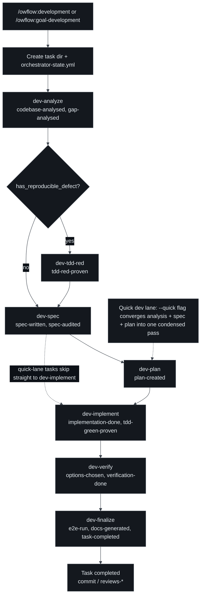
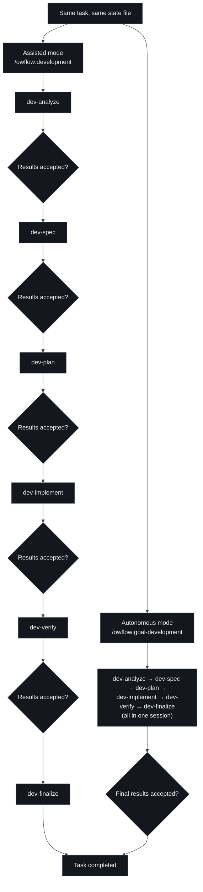
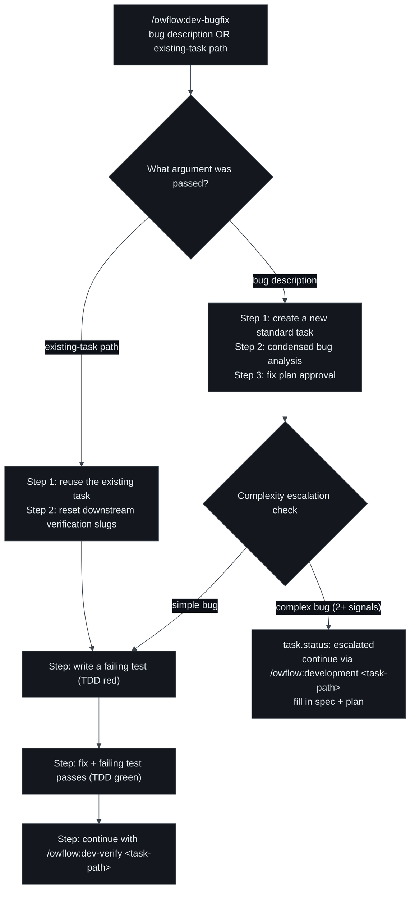
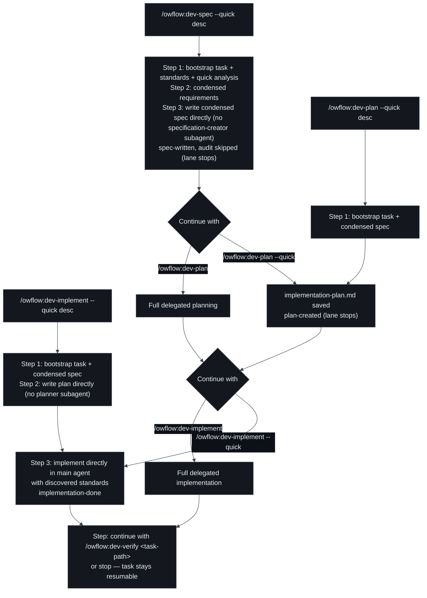
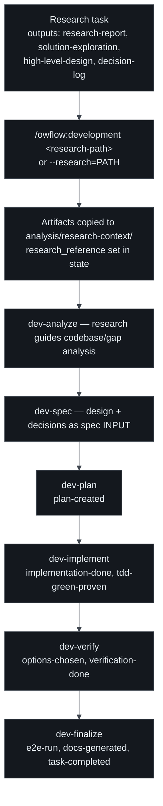

# Workflow Details

Owflow provides four workflow types, each with phases tailored to its needs. All workflows pause between phases for your review and input.

## Development Workflow

Development work runs through a pipeline of standalone **dev-\* subskills**, coordinated by a shared task state file (`orchestrator-state.yml`). Two top-level orchestrators start and route the pipeline:

- **Assisted mode** — `/owflow:development` initializes/resumes the task, derives the next step from state, prints the matching subskill command, and stops. Each subskill runs in a fresh context.
- **Autonomous mode** — `/owflow:goal-development` runs the same subskills back-to-back in one session, pausing at gates between them. Tasks can mix both modes freely.

Both modes share one state format. Progress is tracked as descriptive step slugs in `completed_phases`: `codebase-analysed`, `gap-analysed`, `tdd-red-proven`, `spec-written`, `spec-audited`, `plan-created`, `implementation-done`, `tdd-green-proven`, `options-chosen`, `verification-done`, `e2e-run`, `docs-generated`, `task-completed`.

### Pipeline Steps

| Step slug(s)             | Description                    | Subskill                | Produces                                              |
| ------------------------ | ------------------------------ | ----------------------- | ----------------------------------------------------- |
| `codebase-analysed`      | Codebase + gap analysis        | `/owflow:dev-analyze`   | `analysis/codebase-analysis.md`, `gap-analysis.md`    |
| `tdd-red-proven`         | TDD red gate (conditional — bugs) | `/owflow:dev-tdd-red`   | `implementation/tdd-red-gate.md` (failing test)       |
| `spec-written`, `spec-audited` | Requirements + specification + audit | `/owflow:dev-spec`      | `implementation/spec.md`, `verification/spec-audit.md`|
| `plan-created`           | Implementation planning        | `/owflow:dev-plan`      | `implementation/implementation-plan.md`               |
| `implementation-done`    | Implementation + TDD green gate | `/owflow:dev-implement` | implemented code, `work-log.md`; (full pipeline delegates to implementation-plan-executor) |
| `options-chosen`, `verification-done` | Verification + issue resolution | `/owflow:dev-verify`    | `verification/implementation-verification.md`         |
| `e2e-run`, `docs-generated`, `task-completed` | E2E + user docs + finalization | `/owflow:dev-finalize`  | `documentation/`, completed task                      |

The TDD red gate is skipped unless gap analysis detects a reproducible defect (`has_reproducible_defect: true`). The TDD green gate runs inside dev-implement only when a red gate was executed. Conditional options (`--e2e`, `--user-docs`, `--audit`) are stored in state and honored by the subskills.

### Entry Points

Every entry level below ends in the same pipeline and the same state file — you can enter fast and escalate to the full pipeline at any time.

#### 1. Full pipeline (features, enhancements, bugs)

```bash
/owflow:development "Add two-factor authentication"
/owflow:goal-development "Add two-factor authentication"     # autonomous mode
```

Auto-detects the task type. The dispatcher initializes the task, then hands off step-by-step.


```mermaid
%%{init: {
  "theme": "base",
  "themeVariables": {
    "darkMode": true,
    "background": "#0d1117",
    "primaryColor": "#14181e",
    "primaryTextColor": "#e6edf3",
    "primaryBorderColor": "#3d444d",
    "lineColor": "#3d444d",
    "arrowheadColor": "#4493f8",
    "textColor": "#e6edf3",
    "tertiaryColor": "#181c22",
    "titleColor": "#e6edf3",
    "edgeLabelBackground": "#0d1117",
    "stateLabelColor": "#e6edf3",
    "noteBkgColor": "#181c22",
    "noteBorderColor": "#3d444d",
    "noteTextColor": "#e6edf3"
  }
}}%%
flowchart TD
    entry["/owflow:development or /owflow:goal-development"] --> init["Create task dir + orchestrator-state.yml"]
    init --> analyze["dev-analyze<br/>codebase-analysed, gap-analysed"]
    analyze --> defect{"has_reproducible_defect?"}
    defect -->|"yes"| tddRed["dev-tdd-red<br/>tdd-red-proven"]
    defect -->|"no"| spec
    tddRed --> spec["dev-spec<br/>spec-written, spec-audited"]
    spec --> plan["dev-plan<br/>plan-created"]
    plan --> implement["dev-implement<br/>implementation-done, tdd-green-proven"]
    implement --> verify["dev-verify<br/>options-chosen, verification-done"]
    verify --> finalize["dev-finalize<br/>e2e-run, docs-generated, task-completed"]
    finalize --> done["Task completed<br/>commit / reviews-*"]
    quickLane["Quick dev lane: --quick flag converges analysis + spec + plan into one condensed pass"] -.-> plan
    spec -.->|"quick-lane tasks skip straight to dev-implement"| implement
```

#### 2. Assisted vs Autonomous mode


```mermaid
%%{init: {
  "theme": "base",
  "themeVariables": {
    "darkMode": true,
    "background": "#0d1117",
    "primaryColor": "#14181e",
    "primaryTextColor": "#e6edf3",
    "primaryBorderColor": "#3d444d",
    "lineColor": "#3d444d",
    "arrowheadColor": "#4493f8",
    "textColor": "#e6edf3",
    "tertiaryColor": "#181c22",
    "titleColor": "#e6edf3",
    "edgeLabelBackground": "#0d1117",
    "stateLabelColor": "#e6edf3",
    "noteBkgColor": "#181c22",
    "noteBorderColor": "#3d444d",
    "noteTextColor": "#e6edf3"
  }
}}%%
flowchart TD
    entry["Same task, same state file"] --> assisted["Assisted mode<br/>/owflow:development"]
    entry --> autonomous["Autonomous mode<br/>/owflow:goal-development"]
    assisted --> assistedAnalyze["dev-analyze"] --> assistedGate1{"Results accepted?"} --> assistedSpec["dev-spec"] --> assistedGate2{"Results accepted?"} --> assistedPlan["dev-plan"] --> assistedGate3{"Results accepted?"} --> assistedImplement["dev-implement"] --> assistedGate4{"Results accepted?"} --> assistedVerify["dev-verify"] --> assistedGate5{"Results accepted?"} --> assistedFinalize["dev-finalize"]
    autonomous --> autonomousRun["dev-analyze → dev-spec → dev-plan →<br/>dev-implement → dev-verify → dev-finalize<br/>(all in one session)"] --> autonomousGate{"Final results accepted?"}
    assistedFinalize --> done["Task completed"]
    autonomousGate --> done
```

#### 3. Quick bug lane (`/owflow:dev-bugfix`)

Lightweight TDD-driven bug fix: condensed analysis → approved fix plan → TDD red → fix → TDD green. Creates a **standard** development task (`entry_point: dev-bugfix`), so it is continuable by any dev-\* subskill afterwards. Also used as a consecutive run to fix a newly emerging problem on an existing task (resets downstream verification slugs).


```mermaid
%%{init: {
  "theme": "base",
  "themeVariables": {
    "darkMode": true,
    "background": "#0d1117",
    "primaryColor": "#14181e",
    "primaryTextColor": "#e6edf3",
    "primaryBorderColor": "#3d444d",
    "lineColor": "#3d444d",
    "arrowheadColor": "#4493f8",
    "textColor": "#e6edf3",
    "tertiaryColor": "#181c22",
    "titleColor": "#e6edf3",
    "edgeLabelBackground": "#0d1117",
    "stateLabelColor": "#e6edf3",
    "noteBkgColor": "#181c22",
    "noteBorderColor": "#3d444d",
    "noteTextColor": "#e6edf3"
  }
}}%%
flowchart TD
    entry["/owflow:dev-bugfix<br/>bug description OR existing-task path"] --> mode{"What argument was passed?"}
    mode -->|"bug description"| newTask["Step 1: create a new standard task<br/>Step 2: condensed bug analysis<br/>Step 3: fix plan approval"]
    mode -->|"existing-task path"| existingTask["Step 1: reuse the existing task<br/>Step 2: reset downstream verification slugs"]
    newTask --> escalation{"Complexity escalation check"}
    escalation -->|"simple bug"| tddRed
    escalation -->|"complex bug (2+ signals)"| escalated["task.status: escalated<br/>continue via /owflow:development &lt;task-path&gt;<br/>fill in spec + plan"]
    existingTask --> tddRed["Step: write a failing test (TDD red)"]
    tddRed --> tddGreen["Step: fix + failing test passes (TDD green)"]
    tddGreen --> verify["Step: continue with /owflow:dev-verify &lt;task-path&gt;"]
```

The dispatcher routes bugfix tasks straight to `/owflow:dev-verify` when `implementation-done` is complete (spec/plan are not required for verification). Escalated tasks route through the full pipeline from the first missing slug.

#### 4. Quick dev lane (`--quick`)

Condensed entries that bootstrap a standard task inline, then continue with the lane's condensed work. Three lanes, one per phase cut-off: `/owflow:dev-spec --quick` (spec only), `/owflow:dev-plan --quick` (spec + plan), `/owflow:dev-implement --quick` (spec + plan + implementation). Use when analysis/spec phases can be done in one pass.


```mermaid
%%{init: {
  "theme": "base",
  "themeVariables": {
    "darkMode": true,
    "background": "#0d1117",
    "primaryColor": "#14181e",
    "primaryTextColor": "#e6edf3",
    "primaryBorderColor": "#3d444d",
    "lineColor": "#3d444d",
    "arrowheadColor": "#4493f8",
    "textColor": "#e6edf3",
    "tertiaryColor": "#181c22",
    "titleColor": "#e6edf3",
    "edgeLabelBackground": "#0d1117",
    "stateLabelColor": "#e6edf3",
    "noteBkgColor": "#181c22",
    "noteBorderColor": "#3d444d",
    "noteTextColor": "#e6edf3"
  }
}}%%
flowchart TD
    specQuick["/owflow:dev-spec --quick desc"] --> specQuickSteps["Step 1: bootstrap task + standards + quick analysis<br/>Step 2: condensed requirements<br/>Step 3: write condensed spec directly (no specification-creator subagent)<br/>spec-written, audit skipped (lane stops)"]
    planQuick["/owflow:dev-plan --quick desc"] --> planQuickSteps["Step 1: bootstrap task + condensed spec"]
    implementQuick["/owflow:dev-implement --quick desc"] --> implementQuickSteps["Step 1: bootstrap task + condensed spec<br/>Step 2: write plan directly (no planner subagent)"]
    specQuickSteps --> afterSpec{"Continue with"}
    afterSpec -->|"/owflow:dev-plan"| fullPlan["Full delegated planning"]
    afterSpec -->|"/owflow:dev-plan --quick"| planSaved
    planQuickSteps --> planSaved["implementation-plan.md saved<br/>plan-created (lane stops)"]
    implementQuickSteps --> implemented["Step 3: implement directly in main agent<br/>with discovered standards<br/>implementation-done"]
    planSaved --> afterPlan{"Continue with"}
    afterPlan -->|"/owflow:dev-implement"| fullImplement["Full delegated implementation"]
    afterPlan -->|"/owflow:dev-implement --quick"| implemented
    fullPlan --> afterPlan
    fullImplement --> next
    implemented --> next["Step: continue with /owflow:dev-verify &lt;task-path&gt;<br/>or stop — task stays resumable"]
```

Quick lanes do not use the pipeline's subagents: `dev-spec --quick` writes the condensed spec directly (no `specification-creator`), `dev-plan --quick` writes the plan directly (no `implementation-planner`), and `dev-implement --quick` implements **directly in the main agent** (no `implementation-plan-executor`), applying the standards read during the condensed prelude (with continuous discovery for newly-surfaced areas). The same applies when `--quick` is passed to those subskills on an existing task (e.g., a quick spec or quick plan). Full-pipeline runs are unaffected: without `--quick`, specification, planning, and implementation always delegate. Anything bug-shaped (a proven reproducible defect) still routes through the TDD red gate — `--quick` never bypasses it; see the bugfix lane above.

#### 5. Research-based development

Start interactive development workflow informed by a completed research workflow:

```bash
/owflow:development .owflow/tasks/research/2026-01-12-oauth-research
/owflow:development "Implement OAuth" --research=.owflow/tasks/research/2026-01-12-oauth-research
```


```mermaid
%%{init: {
  "theme": "base",
  "themeVariables": {
    "darkMode": true,
    "background": "#0d1117",
    "primaryColor": "#14181e",
    "primaryTextColor": "#e6edf3",
    "primaryBorderColor": "#3d444d",
    "lineColor": "#3d444d",
    "arrowheadColor": "#4493f8",
    "textColor": "#e6edf3",
    "tertiaryColor": "#181c22",
    "titleColor": "#e6edf3",
    "edgeLabelBackground": "#0d1117",
    "stateLabelColor": "#e6edf3",
    "noteBkgColor": "#181c22",
    "noteBorderColor": "#3d444d",
    "noteTextColor": "#e6edf3"
  }
}}%%
flowchart TD
    research["Research task<br/>outputs: research-report, solution-exploration,<br/>high-level-design, decision-log"] --> start["/owflow:development &lt;research-path&gt;<br/>or --research=PATH"]
    start --> copy["Artifacts copied to analysis/research-context/<br/>research_reference set in state"]
    copy --> analyze["dev-analyze — research guides codebase/gap analysis"]
    analyze --> spec["dev-spec — design + decisions as spec INPUT"]
    spec --> plan["dev-plan<br/>plan-created"]
    plan --> implement["dev-implement<br/>implementation-done, tdd-green-proven"]
    implement --> verify["dev-verify<br/>options-chosen, verification-done"]
    verify --> finalize["dev-finalize<br/>e2e-run, docs-generated, task-completed"]
```

#### 6. Standalone subskills

Each dev-\* subskill is standalone and can be invoked directly with a task path or identifier; it validates prerequisites from state and prints the ordered prerequisite steps with exact commands if something is missing. Never auto-picks a task. The usual reason to enter mid-pipeline is resuming: `/owflow:dev-verify`, `/owflow:dev-finalize`, or continuing an escalated/bugfix task with `/owflow:dev-spec`.

### Flags

`--from=<step-slug>`, `--research=PATH`, `--audit`/`--no-audit`, `--e2e`/`--no-e2e`, `--user-docs`/`--no-user-docs`

### Resume

```bash
/owflow:development [task-path] [--from=<step-slug>] [--reset-attempts]
```

Resume derives from state: the first step slug not in `completed_phases` determines the next subskill; `--from` overrides (prerequisites are validated). Works across assisted and autonomous modes, including tasks started by `/owflow:dev-bugfix` or a `--quick` lane.

### Auto-Recovery

Retries are owned by each subskill (max attempts per phase):

| Subskill       | Max Attempts | Strategy                            |
| -------------- | ------------ | ----------------------------------- |
| dev-analyze    | 2            | Expand search, re-analyze, ask user |
| dev-tdd-red    | 2            | Rewrite test, skip TDD with doc     |
| dev-spec       | 2            | Regenerate spec                     |
| dev-plan       | 2            | Regenerate plan                     |
| dev-implement  | 5 (green)    | Fix syntax, imports, tests          |
| dev-verify     | 3 (loop)     | Fix issues, re-run verification     |
| dev-finalize   | 3            | Fix tests, re-run                   |

---

## Performance Optimization

Static code analysis to detect bottlenecks, followed by standard spec/plan/implement/verify pipeline.

```
/owflow:performance
/owflow:performance "Optimize dashboard loading time"
```

### Pipeline Steps

| Step slug(s)                                  | Description                                                         | Subskill                        | Produces                                                                                          |
| --------------------------------------------- | ------------------------------------------------------------------- | ------------------------------- | ------------------------------------------------------------------------------------------------- |
| `codebase-analysed`, `bottlenecks-identified` | Codebase analysis + clarifications, then static bottleneck analysis | `/owflow:performance-analyze`   | `analysis/codebase-analysis.md`, `analysis/clarifications.md`, `analysis/performance-analysis.md` |
| `spec-written`, `spec-audited` (conditional)  | Requirements + specification + audit                                | `/owflow:performance-spec`      | `analysis/requirements.md`, `implementation/spec.md`, `verification/spec-audit.md` (conditional)  |
| `plan-created`                                | Implementation planning                                             | `/owflow:performance-plan`      | `implementation/implementation-plan.md`                                                           |
| `implementation-done`                         | Implementation execution                                            | `/owflow:performance-implement` | implemented optimizations, `implementation/work-log.md`                                           |
| `options-chosen`, `verification-done`         | Verification options, verification, issue resolution                | `/owflow:performance-verify`    | `verification/implementation-verification.md`                                                     |
| `task-completed`                              | Finalization                                                        | `/owflow:performance-finalize`  | completed task                                                                                    |

**Optional profiling data**: You can provide runtime profiling data, flame graphs, or APM screenshots. The workflow creates `analysis/user-profiling-data/` for these files.

### Resume

```
/owflow:performance [task-path] [--from=<slug>]
```

Resume uses the step slugs recorded in the task's `orchestrator-state.yml` (`completed_phases`).

---

## Migration

Technology, data, and architecture migrations with rollback planning and risk assessment. Migration runs through a pipeline of standalone **`migration-*` subskills**, coordinated by a shared task state file (`orchestrator-state.yml`) — the same split as development and research:

- **Assisted mode** — `/owflow:migration` initializes/resumes the task, derives the next step from state, prints the matching subskill command, and stops. Each subskill runs in a fresh context.
- **Autonomous mode** — `/owflow:goal-migration` runs the same subskills back-to-back in one session, pausing at gates between them. Tasks can mix both modes freely.
- **No quick lane** — every migration runs the full pipeline.

```
/owflow:migration
/owflow:migration "Migrate from REST to GraphQL" --type=code
```

**Migration types**: `code`, `data`, `architecture`, `general`

**Flags** (dispatcher and `goal-migration`): `--from=<slug>` (resume from a step), `--type=<type>` (default classification — `migration-target` still confirms on low confidence), `--no-web-research` (skip the external research step)

### Pipeline Steps

Progress is tracked as descriptive step slugs in `completed_phases`: `state-analysed`, `target-planned`, `strategy-specified`, `plan-created`, `migration-executed`, `options-chosen`, `verification-done`, `issues-resolved`, `docs-generated`, `task-completed`.

| Step slug(s) | Description | Subskill | Produces |
| --- | --- | --- | --- |
| `state-analysed` | Current-state analysis + clarifications | `/owflow:migration-analyze` | `analysis/current-state-analysis.md`, `analysis/clarifications.md` |
| `target-planned` | Target state + gap inventory + risk lock | `/owflow:migration-target` | `analysis/target-state-plan.md` |
| `strategy-specified` | Requirements + strategy + rollback/dual-run plans | `/owflow:migration-spec` | `analysis/requirements.md`, `implementation/spec.md`, `analysis/rollback-plan.md`, `analysis/dual-run-plan.md` (conditional) |
| `plan-created` | Implementation planning with per-group rollback steps | `/owflow:migration-plan` | `implementation/implementation-plan.md` |
| `migration-executed` | Migration execution | `/owflow:migration-implement` | implemented changes, `implementation/work-log.md` |
| `options-chosen`, `verification-done` | Verification + compatibility testing | `/owflow:migration-verify` | `verification/implementation-verification.md`, `verification/compatibility-test-results.md` |
| `issues-resolved` | Issue resolution (conditional — halts on data integrity) | `/owflow:migration-fix` | fixes applied, `verification_context.fixes_applied` |
| `docs-generated`, `task-completed` | Optional migration guide + finalization | `/owflow:migration-finalize` | `documentation/migration-guide.md` (optional), completed task |

**Key behaviors**:

- Rollback planning is mandatory; every task group in the plan carries a rollback/checkpoint step
- Dual-run support for zero-downtime migrations
- Halts on data integrity issues (no automatic recovery; user-confirmed rollback only)
- External research for version upgrades via web search, unless `--no-web-research`

### Resume

```
/owflow:migration [task-path] [--from=<slug>]
```

Resume derives from state: the first step slug not in `completed_phases` determines the next subskill; `--from` overrides with a step slug — `state-analysed`, `target-planned`, `strategy-specified`, `plan-created`, `migration-executed`, `options-chosen`, `verification-done`, `issues-resolved`, `docs-generated`, `task-completed` (prerequisites are validated). Works across assisted and autonomous modes.

---

## Research

Multi-source research with synthesis, optional solution brainstorming, and high-level design. Research runs through a pipeline of standalone **`research-*` subskills**, coordinated by a shared task state file (`orchestrator-state.yml`) — the same split as development:

- **Assisted mode** — `/owflow:research` initializes/resumes the task, derives the next step from state, prints the matching subskill command, and stops. Each subskill runs in a fresh context.
- **Autonomous mode** — `/owflow:goal-research` runs the same subskills back-to-back in one session, pausing at gates between them. Tasks can mix both modes freely.
- **Quick lane** — `/owflow:research-quick "<description>"` bootstraps a standard research task and fuses brief, plan, gather, and synthesis into one condensed pass, continuable by any research subskill.

```
/owflow:research
/owflow:research "What authentication approach fits our architecture?" --type=technical
```

**Research types**: `technical`, `requirements`, `literature`, `mixed`

**Flags** (dispatcher and `goal-research`): `--from=<slug>` (resume from a step), `--type=<type>` (force the methodology classification)

### Pipeline Steps

Progress is tracked as descriptive step slugs in `completed_phases`: `brief-written`, `plan-created`, `findings-gathered`, `synthesis-complete`, `alternatives-generated`, `approaches-chosen`, `design-generated`, `research-completed`.

| Step slug(s)                             | Description                              | Subskill                       | Produces                                                        |
| ---------------------------------------- | ---------------------------------------- | ------------------------------ | --------------------------------------------------------------- |
| `brief-written`, `plan-created`           | Research brief, methodology, plan + sources | `/owflow:research-plan`        | `planning/research-brief.md`, `research-plan.md`, `sources.md`   |
| `findings-gathered`                       | Parallel gathering across source categories | `/owflow:research-gather`     | `analysis/findings/*.md`                                        |
| `synthesis-complete`                      | Synthesis + evidence-based research report | `/owflow:research-synthesize` | `analysis/synthesis.md`, `outputs/research-report.md`           |
| `alternatives-generated`                  | Solution-alternative brainstorming (optional — invoked at the user's choice) | `/owflow:research-brainstorm` | `outputs/solution-exploration.md`                            |
| `approaches-chosen`                       | Per-area approach decisions (after brainstorming) | `/owflow:research-converge`   | chosen approach per decision area (state)                       |
| `design-generated`                        | High-level design + decision log (optional — invoked at the user's choice, or after convergence) | `/owflow:research-design` | `outputs/high-level-design.md`, `outputs/decision-log.md`       |
| `research-completed`                      | Output inventory, confirmation, completion | `/owflow:research-finalize`  | task completed                                                  |

The optional chain is the user's choice — there is no enablement flag and no separate decision step. Invoking `research-brainstorm` or `research-design` IS the decision to run it; skipping straight to `research-finalize` settles the chain as skipped. In `goal-research` mode the choice is asked at the gate after synthesis.

Information gathering runs parallel subagents across multiple source categories (codebase, docs, config, external).

### Resume

```bash
/owflow:research [task-path] [--from=<slug>]
```

Resume derives from state: the first step slug not in `completed_phases` determines the next subskill; `--from` overrides with a step slug — `brief-written`, `plan-created`, `findings-gathered`, `synthesis-complete`, `alternatives-generated`, `approaches-chosen`, `design-generated`, `research-completed` (prerequisites are validated). Works across assisted and autonomous modes, including tasks started by the `research-quick` lane.

---

## Task Directory Structure

All workflows create structured directories in `.owflow/tasks/`:

```
.owflow/tasks/
├── development/           # All development tasks (features, bugs, enhancements)
├── performance/           # Performance optimization
├── migrations/            # Migration tasks (dispatcher + migration-* subskills)
├── research/              # Research
```

Each task folder follows the pattern `YYYY-MM-DD-task-name/`. Development tasks (shown below) carry the full pipeline artifacts — every entry point (dispatcher, autonomous mode, bugfix lane, quick lanes) writes into this same structure:

```
2026-02-17-user-auth/
├── orchestrator-state.yml          # Canonical state — step slugs, options, summaries
├── summary.md                      # dev-bugfix fix-run summary (if used)
├── analysis/
│   ├── codebase-analysis.md        # dev-analyze
│   ├── clarifications.md           # dev-analyze
│   ├── gap-analysis.md             # dev-analyze
│   ├── findings.md                 # dev-bugfix (condensed bug analysis)
│   ├── quick-analysis.md           # quick lanes (condensed prelude analysis)
│   ├── requirements.md             # dev-spec / dev-spec --quick
│   ├── research-context/           # Research artifacts (if --research used)
│   └── visuals/                    # user-provided mockups
├── implementation/
│   ├── spec.md                     # Specification (WHAT to build) — dev-spec / quick lanes
│   ├── implementation-plan.md      # Step breakdown (HOW) — dev-plan
│   ├── fix-plan.md                 # dev-bugfix (condensed, approval-gated)
│   ├── tdd-red-gate.md             # dev-tdd-red / dev-bugfix (conditional)
│   ├── tdd-green-gate.md           # dev-implement / dev-bugfix (conditional)
│   └── work-log.md                 # Chronological activity log
├── verification/
│   ├── spec-audit.md               # dev-spec (recommended)
│   ├── implementation-verification.md  # dev-verify
│   └── e2e-verification-report.md  # dev-finalize (optional)
└── documentation/                  # User-facing docs (optional)
```

## Internal Skills

These skills are invoked automatically by the orchestrators and dev-\* subskills — you don't call them directly:

| Skill                            | What It Does                                                                                                                                    |
| -------------------------------- | ----------------------------------------------------------------------------------------------------------------------------------------------- |
| **codebase-analyzer**            | Launches parallel Explore subagents to analyze your codebase, synthesizes findings into a report                                                |
| **implementer**                  | Executes implementation plans with mandatory standards reading and test-driven enforcement                                                      |
| **implementation-plan-executor** | Delegates every task group to the task-group-implementer subagent with continuous standards discovery (full-pipeline runs only — `--quick` tasks implement directly in dev-implement)                 |
| **implementation-verifier**      | Delegates verification to specialized subagents: test runner, code reviewer, pragmatic reviewer, reality assessor, production readiness checker |
| **task-classifier**              | Classifies task descriptions into types (bug, feature, enhancement, performance, migration, research) with confidence scoring                   |
| **docs-manager**                 | Internal engine for managing `.owflow/docs/` structure, INDEX.md, and standards files                                                           |
