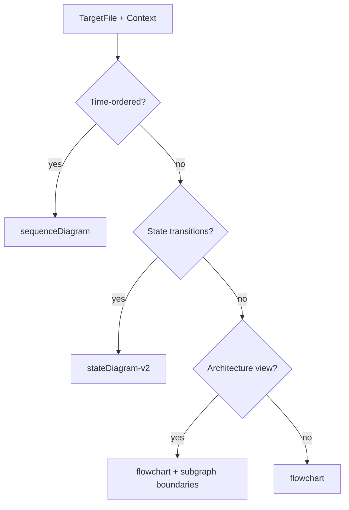
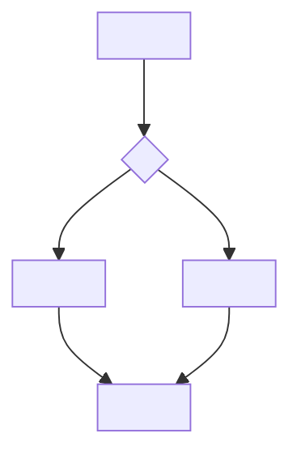
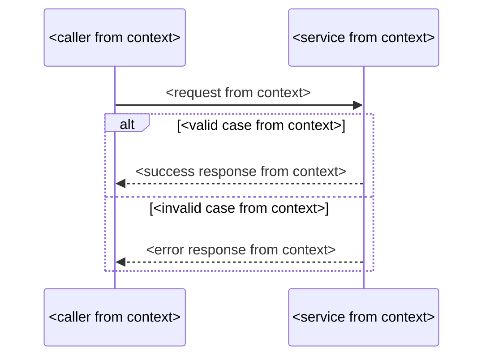
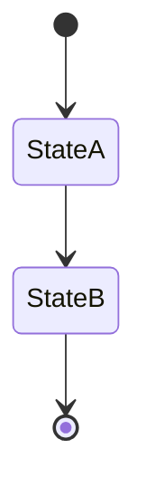
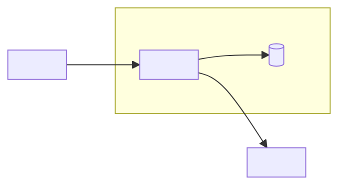

# Mermaid Diagram Reference

Quick reference for selecting, theming, and writing diagrams in planning workflows.

Hard rules and behavior are owned by `../SKILL.md` (file-first output, context-derived labels, fenced ` ```mermaid ` blocks only). Syntax constraints for this reference:

- Supported types: `flowchart`, `sequenceDiagram`, `stateDiagram-v2`.
- Any other fenced diagram format (for example ` ```c4plantuml ` or ` ```plantuml `) is not allowed.

## Themes

Default: **github-dark**. Use **github-light** only when the target document/surface is light (print, light docs) or the user asks. Apply exactly one theme per document by copying the directive below as the **first line inside the mermaid fence**, before the diagram type.

### github-dark (default)

```text
%%{init: {
  "theme": "base",
  "themeVariables": {
    "darkMode": true,
    "background": "#0d1117",
    "primaryColor": "#14181e",
    "primaryTextColor": "#e6edf3",
    "primaryBorderColor": "#3d444d",
    "lineColor": "#3d444d",
    "arrowheadColor": "#4493f8",
    "textColor": "#e6edf3",
    "tertiaryColor": "#181c22",
    "titleColor": "#e6edf3",
    "edgeLabelBackground": "#0d1117",
    "stateLabelColor": "#e6edf3",
    "noteBkgColor": "#181c22",
    "noteBorderColor": "#3d444d",
    "noteTextColor": "#e6edf3"
  }
}}%%
```

### github-light

```text
%%{init: {
  "theme": "base",
  "themeVariables": {
    "darkMode": false,
    "background": "#ffffff",
    "primaryColor": "#f8f8f9",
    "primaryTextColor": "#1f2328",
    "primaryBorderColor": "#d1d9e0",
    "lineColor": "#d1d9e0",
    "arrowheadColor": "#0969da",
    "textColor": "#1f2328",
    "tertiaryColor": "#f4f4f4",
    "titleColor": "#1f2328",
    "edgeLabelBackground": "#ffffff",
    "stateLabelColor": "#1f2328",
    "noteBkgColor": "#f4f4f4",
    "noteBorderColor": "#d1d9e0",
    "noteTextColor": "#1f2328"
  }
}}%%
```

### Palette (source of truth)

| Role               | github-dark | github-light |
| ------------------ | ----------- | ------------ |
| background         | `#0d1117`   | `#ffffff`    |
| text / foreground  | `#e6edf3`   | `#1f2328`    |
| edges (line)       | `#3d444d`   | `#d1d9e0`    |
| arrowheads (accent) | `#4493f8`   | `#0969da`    |
| muted labels       | `#9198a1`   | `#59636e`    |
| node fill          | `#14181e`   | `#f8f8f9`    |
| group/note tint    | `#181c22`   | `#f4f4f4`    |

`muted` is the source theme's secondary-text accent; no Mermaid `themeVariable` maps to it directly, so it is listed for palette fidelity only — the directives above never emit it.

### Theme rules

- `github-dark` is the default; never invent other palettes or a third theme, and use the same directive for every diagram in one document.
- First line inside the fence, before the diagram type — no comments or blank lines before it.
- No other `style`/`classDef` color directives; never encode meaning in color alone.
- Standard Mermaid (`theme: base` + `themeVariables`); renderers that ignore it fall back to their active theme, while some strict or older parsers may reject the multiline form — verify rendering in the target surface when theming matters.

### Placement example

Every diagram starts with the full directive above as its first line, then the diagram source (the directive below is elided — copy the complete block, never this snippet):

```text
%%{init: { ...github-dark themeVariables from above... }}%%
flowchart LR
  request["Incoming request"] --> validate{"Valid?"}
  validate -->|"yes"| handle["Handle"]
  validate -->|"no"| reject["Reject"]
```

## Quick Type Selector



The selector is illustrative and omits the theme directive; production diagrams always include it as the first line.

## Minimal Templates

Syntax shapes only — replace every `<...>` placeholder and role ID with context-derived names before shipping. Examples here also omit the theme directive for brevity; production diagrams always include it as the first line.

### flowchart



`pathA` / `pathB` are role placeholders — use the real step names from context.

### sequenceDiagram



### stateDiagram-v2



`StateA` / `StateB` are role placeholders — use the real state names from context.

### Architecture view (flowchart + subgraphs)



`subgraph` marks the boundary; one abstraction level per diagram; split landscape and component views into separate diagrams.

## Anti-Patterns

Behavioral anti-patterns (chat-only output, invented domain context, shipped placeholders, abstraction mixing, off-palette styling, non-`mermaid` fences) are owned by `../SKILL.md` → Anti-Examples; this reference deliberately does not restate them.

## "Bad -> Better" Examples

### Inventing missing context

Bad:

- "Assume we also have Kafka and Redis" (not provided by user/context)

Better:

- "Current context is missing messaging/storage components. Please confirm whether any queue/cache exists."

### Mixed detail levels

Bad:

- One diagram contains external systems, services, and method-level internals.

Better:

- Diagram 1: architecture view (`flowchart` with subgraphs); Diagram 2: `sequenceDiagram` for one critical interaction.

## Parser Safety Notes

- Use quoted labels for text with special characters.
- Avoid fragile IDs and reserved keywords.
- Prefer clear ASCII names for IDs.
- Keep one diagram focused on one communication concern.

## Integration Candidates

Integrated into (content-preserving refinement, target file in parentheses):

- `src/skills/flow-init/SKILL.md` — Phase 6 (`.owflow/docs/project/architecture.md`, `.owflow/docs/project/tech-stack.md`)
- `src/skills/dev-spec/SKILL.md` — `spec-written` (`implementation/spec.md`); `src/skills/dev-plan/SKILL.md` — `plan-created` (`implementation/implementation-plan.md`)
- `src/skills/research-design/SKILL.md` — `design-generated` (`outputs/high-level-design.md`)
- `src/skills/performance-spec/SKILL.md` — `spec-written` (`implementation/spec.md`); `src/skills/performance-plan/SKILL.md` — `plan-created` (`implementation/implementation-plan.md`)
- `src/skills/migration-spec/SKILL.md` — `strategy-specified` (`implementation/spec.md`); `src/skills/migration-plan/SKILL.md` — `plan-created` (`implementation/implementation-plan.md`)

Reference files:

- `src/skills/flow-init/references/architecture-template.md`
- `src/skills/orchestrator-framework/references/orchestrator-patterns.md`
